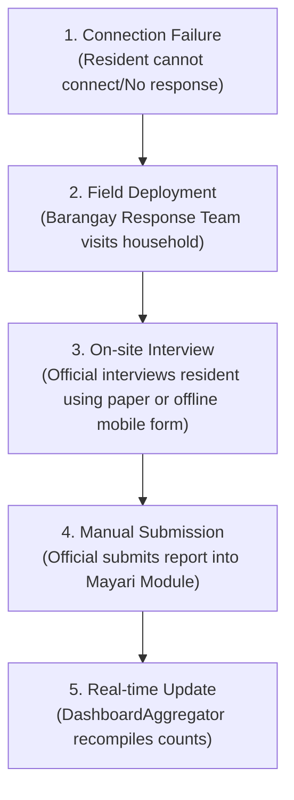
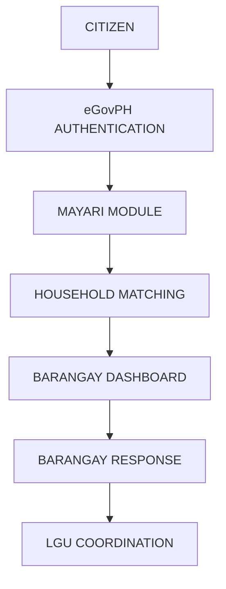

**HANDA**

**Household Assessment and Needs Determination Application**

*System Architecture — Modules & Process*

# **5. System Process**

The system is organized into seven modules. Two are treated as “deep modules” — small interfaces hiding logic that can evolve independently and are unit-tested in isolation from the UI: HouseholdMatcher and DashboardAggregator.

Data relationships: each household report links exactly one Household record to one Incident Assessment, so DashboardAggregator can aggregate per household, per assessment, without ambiguity; HouseholdMatcher reads from the same Household records to resolve incoming check-ins.

| Module | Responsibility | Interface / Notes |
| --- | --- | --- |
| Incident AssessmentService | Create, activate, and close/archiveIncident Assessments; store Incident Assessment metadata and its question set. | Simple CRUD interface; the rest of the app depends only on this interface, not on its data source. |
| QuestionBuilder | UI and logic for officials to define, edit, and reuse question sets per Incident Assessment. | Feeds structured question definitions into Incident AssessmentService. |
| CheckInFlow | Resident-facing sequence: disaster prompt → yes/no → household match/select → answer questions → confirmation. | Consumes HouseholdMatcher and the active Incident Assessment's question set. |
| HouseholdMatcher (deep) | Resolves a resident's check-in to an existing household record, or returns candidates for manual selection. | match(residentInfo) → household \| candidates[] |
| DashboardAggregator (deep) | Aggregates raw check-in responses into: total affected households, need-type breakdown, resolved/unresolved lists, and non-respondents. | Pure aggregation logic, independent of how the dashboard renders it. Applies verification flags to conflicting or unverified reports before aggregation, so disputed data does not distort published counts. |
| StatusTracker | Simple state transition allowing an official to mark a household's case as visited/resolved for a given Incident Assessment. | Tied to household + Incident Assessment. |
| ExportService | Generates a CSV/table export of affected households and their needs for LGU/local-org hand-off. | Consumes DashboardAggregator output. |

> **[Diagram: Offline Outreach Workflow]**
> 
> *Description:* A 5-step sequential workflow describing how offline field responders handle resident data collection when connectivity is unavailable.

> **[Diagram: Streamlined Government Response System | eGovPH Process Flow]**
> 
> *Description:* A vertical flow diagram illustrating the citizen-centric process flow from citizen authentication down to LGU coordination.

