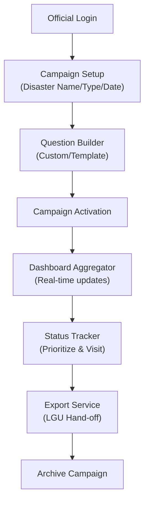
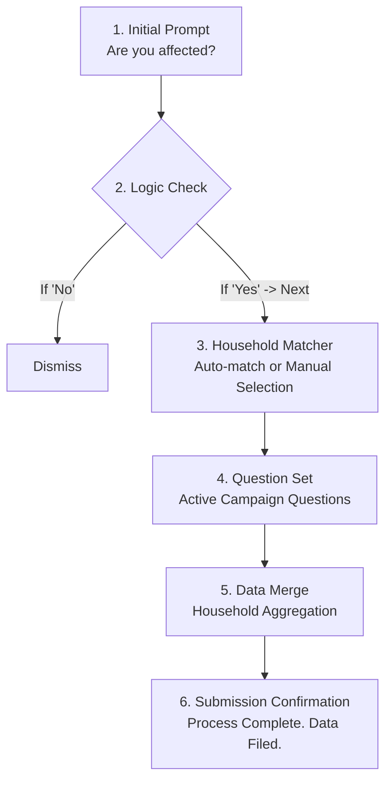
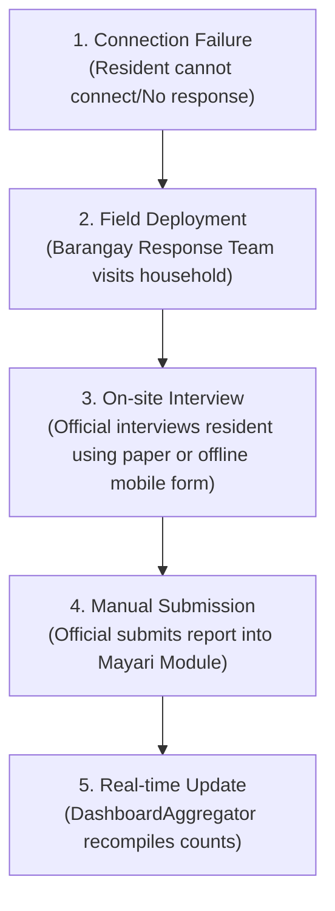
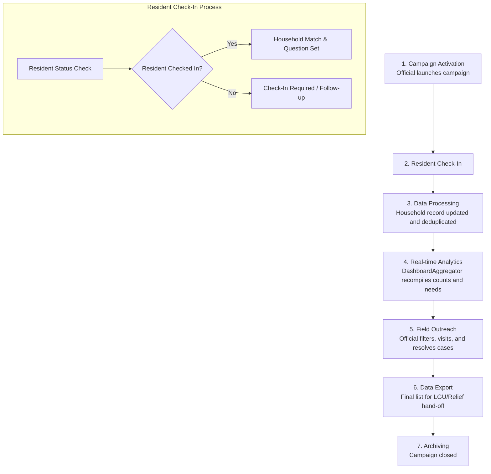
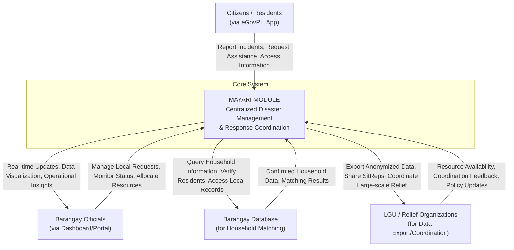
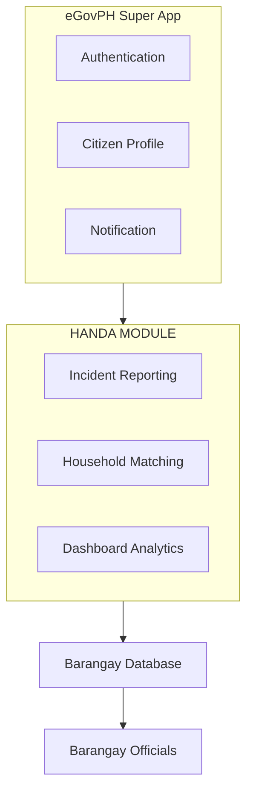

**HANDA**

**Household Assessment and Needs Determination Application**

*System Modeling — Workflow & Context Diagram*

# **6. System Workflow**

## **6.1 Barangay Official Workflow (Incident Assessment Setup & Monitoring)**

Official logs in with an authenticated account.

Officials create a new Incident Assessment, entering the disaster name, type, and date.

Official defines custom follow-up questions, or reuses a question set from a previous Incident Assessment, via QuestionBuilder.

Official activates/publishes the Incident Assessment, opening it to resident check-ins.

As residents check in, DashboardAggregator continuously updates: total affected households, need-type breakdown, and the non-respondent list.

Official filters the dashboard by need type or status to prioritize response, and visits or coordinates outreach accordingly.

Official marks each visited household's case as “visited” or “resolved” via StatusTracker.

Official exports the affected-households list via ExportService for hand-off to the LGU or local relief organizations.

Once the relief period ends, the official closes or archives the Incident Assessment, so the live dashboard reflects only active situations. Submissions received shortly after closure are held in a short grace period (e.g., 24 hours) before the assessment is fully archived.


> **[Diagram: Barangay Official Workflow]**
> 
> *Description:* An 8-step workflow showing the lifecycle of a disaster incident campaign managed by a Barangay Official.




## **6.2 Resident Check-In Workflow**

The resident sees a simple “Are you affected by [Disaster]?” prompt.

If “No,” resident dismisses the prompt — no report is created.

If “Yes,” HouseholdMatcher attempts to auto-match the resident to an existing household/family record.

If no automatic match is found, the resident selects their household from the barangay's family list.

Residents answer the barangay-defined question set for the active Incident Assessment (e.g., home damage, medical need, food/water need).

The report is submitted and matched to the household record; if other family members have already reported, the new answers are merged under the same household entry rather than creating a duplicate.

Residents receive on-screen confirmation that the barangay has been notified.


> **[Diagram: Resident Check-In Workflow]**
> 
> *Description:* A flowchart detailing the citizen-facing check-in process from initial disaster prompt to submission confirmation.




If a mistake is noticed afterward, the resident may request an edit, or an official may reopen the report, at any point before the Incident Assessment is closed.

## **6.3 End-to-End Flow Summary**


> **[Diagram: Offline Outreach Workflow]**
> 
> *Description:* A 5-step sequential workflow describing how offline field responders handle resident data collection when connectivity is unavailable.




This flow describes offline handling for field responders only; residents themselves cannot submit reports without connectivity.

Connection failure detected — Resident attempts to check in but has no connectivity (device/network failure); no report is received.

Field deployment — Barangay Response Team is dispatched to the household in person (identified via the non-respondent list from Step 4 above).

On-site interview — Team member conducts the same Incident Assessment question set with the resident, using a paper form or an offline-capable mobile form.

Manual submission — Once connectivity is available, the official manually enters the collected responses into the Handa module .

Real-time update — DashboardAggregator recomputes counts, needs breakdown, and non-respondents exactly as in Step 4 of the online path — the offline report is now indistinguishable from an online one in the dashboard.


> **[Diagram: Integrated Disaster Response Workflow]**
> 
> *Description:* An end-to-end 7-phase disaster response workflow integrating campaign activation, resident check-in, data processing, real-time analytics, field outreach, data export, and archiving.




# **6. Context Diagram**

eGovPH Super App


> **[Diagram: System Context Diagram: Mayari Disaster Response]**
> 
> *Description:* A system context diagram displaying the central MAYARI MODULE interacting with Citizens, Barangay Officials, Barangay Database, and LGU / Relief Organizations.



### Architecture Integration Hierarchy

```text
               eGovPH Super App
                      │
  ┌───────────────────┼───────────────────┐
  │                   │                   │
Authentication  Citizen Profile      Notification
  │                   │                   │
  └───────────────────┬───────────────────┘
                      │
                 HANDA MODULE
                      │
  ┌───────────────────┼───────────────────┐
  │                   │                   │
Incident           Household          Dashboard
Reporting          Matching           Analytics
                      │
              Barangay Database
                      │
              Barangay Officials
```


